<div align="center"

# 👁️ The Vision Invariant: A Mathematical Theory of Perception

<div align="center">


### **Vision is Not the Image. Vision is the Topology of Meaning Around the Image.**

$$\boxed{\textbf{Vision} = \text{Topology}\big(\mathcal{N}(X, I_{\text{vision}})\big)}$$

*Perception arises from geometric structure, not pixel classification.*

-----

[](https://www.linkedin.com/in/davarn-morrison-14b93b263)
[](#)

**Theorist:** [Davarn Morrison](https://www.linkedin.com/in/davarn-morrison-14b93b263)  
**Related Patent:** GB2602072.7 (Morrison Law of Perception)  
**Status:** Hypothesis with testable predictions

</div>

-----

## 🔄 The Vision Pipeline

```mermaid
graph LR
    A[Pixels<br/>Raw Input] --> B[Neighborhood 𝒩<br/>Possible Interpretations]
    B --> C[Topology<br/>Geometric Structure]
    C --> D[Perception<br/>Stable Manifold]
    
    style A fill:#95a5a6,stroke:#7f8c8d,stroke-width:2px
    style B fill:#3498db,stroke:#2980b9,stroke-width:3px
    style C fill:#9b59b6,stroke:#8e44ad,stroke-width:3px
    style D fill:#2ecc71,stroke:#27ae60,stroke-width:4px
```



**Vision doesn’t process pixels → It extracts topology → Then selects stable structure**

-----

## 🎯 Theory Origins

**The Problem:** Current AI vision systems are fundamentally fragile—tiny pixel changes can fool them completely, while humans remain robust. This is because AI uses **semantic classification** (matching pixels to labels), which can be fooled.

**Why Semantics Fails:** Deepfakes, adversarial examples, and hallucinations all exploit the fact that signals can be copied but meaning cannot be guaranteed. No amount of training data fixes this—it’s a fundamental architectural problem.

**Why Topology:** Geometric structure cannot be faked without reconstructing the entire underlying manifold. By defining vision as the extraction of topological invariants from the neighborhood of possible interpretations, we create a system that is **mathematically robust** to adversarial manipulation.

-----

## 📘 The Core Hypothesis

**Vision is not image classification.**

**Vision is the extraction of topological structure from the neighborhood of possible interpretations.**

### **The Mathematical Statement**

$$\boxed{\textbf{Vision} = \text{Topology}\big(\mathcal{N}(X, I_{\text{vision}})\big)}$$

**Where:**

<div align="center">

|Symbol            |Meaning                  |Description                                                       |
|------------------|-------------------------|------------------------------------------------------------------|
|**X**             |Current state            |The agent’s current perceptual state                              |
|**I_vision**      |Input manifold           |Light, contrast, edges, spatial patterns                          |
|**𝒩(X, I_vision)**|Interpretive neighborhood|All possible interpretations the system can resolve from the input|
|**Topology(·)**   |Topological structure    |Homology, Betti numbers, connectivity, stable manifolds           |

</div>

### **In Plain Language**

When you see an object, your brain is not:

- ❌ Capturing pixels
- ❌ Matching templates
- ❌ Classifying semantic categories

Your brain is:

- ✅ Mapping possible interpretations nearby
- ✅ Extracting stable geometric structure
- ✅ Computing topological invariants
- ✅ Selecting the simplest stable manifold

**Vision is geometry, not semantics.**

-----

## 🎯 Why This Matters

### **The Current Paradigm (Broken)**

```
Traditional AI Vision:
  Vision = argmax(Semantic_Label | Pixels)
  
Problems:
  ❌ Fragile to adversarial examples
  ❌ Can't handle partial occlusion well
  ❌ Needs massive training data
  ❌ No rotation invariance
  ❌ No cross-modal transfer
```

### **The Vision Invariant (Correct)**

```
Morrison Vision Theory:
  Vision = Topology(𝒩(X, I_vision))
  
Advantages:
  ✅ Explains rotation invariance
  ✅ Explains filling-in effects
  ✅ Explains why humans are robust
  ✅ Predicts when AI will fail
  ✅ Enables cross-modal perception
```

-----

## 🔬 The Three Testable Claims

A scientific hypothesis must be **falsifiable**. Here are three claims that can be experimentally tested:

### **Claim 1: Stability Claim**

> **If the topology of the interpretive neighborhood remains unchanged under transformation, vision will remain stable.**

**Prediction:**

```
Given:
  - Object in orientation A → Topology_A
  - Same object in orientation B → Topology_B

If Topology_A ≅ Topology_B (isomorphic):
  → Subject recognizes as same object
  
If Topology_A ≉ Topology_B (not isomorphic):
  → Subject perceives as different object
```

**Example Where It Works:**

- Coffee cup rotated 90° → Topology preserved → Recognized ✅
- Handle connectivity unchanged
- Surface genus unchanged
- Opening topology unchanged

**Example Where It Fails:**

- Text “d” vs “b” → Topology changes (orientation) → Not confused ✅
- Mirror reflection changes chirality
- Topological structure differs

**Experimental Test:**

```python
def test_stability_claim(object, transformations):
    for T in transformations:
        object_transformed = apply_transformation(object, T)
        
        topology_original = compute_topology(object)
        topology_transformed = compute_topology(object_transformed)
        
        # Prediction
        if is_isomorphic(topology_original, topology_transformed):
            assert subject_recognizes(object, object_transformed) == True
        else:
            assert subject_recognizes(object, object_transformed) == False
```

-----

### **Claim 2: Collapse Claim**

> **Hallucinations arise when the neighborhood contains no valid stable structure.**

**Prediction:**

```
Given:
  - Visual stimulus S
  - Interpretive neighborhood 𝒩(X, S)

If 𝒩 contains NO stable topological structure:
  → Subject hallucinates OR reports uncertainty
  
If 𝒩 contains stable structure:
  → Subject perceives clearly
```

**Example: Rubin’s Vase**

```
Stimulus: Ambiguous figure (face or vase?)

𝒩 contains TWO stable topologies:
  1. Two faces (2 connected components)
  2. One vase (1 connected component)

Prediction: Subject oscillates between interpretations
Reality: ✅ Exactly what happens
```

**Example: White Noise**

```
Stimulus: Random TV static

𝒩 contains NO stable topology
  - No consistent edges
  - No stable surfaces
  - No connected components

Prediction: Subject sees "nothing meaningful"
Reality: ✅ People report random patterns
```

**Experimental Test:**

```python
def test_collapse_claim(stimulus):
    neighborhood = construct_interpretive_neighborhood(stimulus)
    stable_structures = find_stable_topologies(neighborhood)
    
    if len(stable_structures) == 0:
        # Prediction: hallucination or uncertainty
        assert subject_reports_uncertainty(stimulus) == True
    elif len(stable_structures) == 1:
        # Prediction: clear perception
        assert subject_perceives_clearly(stimulus) == True
    else:
        # Prediction: oscillation between interpretations
        assert subject_oscillates(stimulus) == True
```

-----

### **Claim 3: Predictive Claim (Simplicity Principle)**

> **When the neighborhood contains multiple valid structures, vision chooses the simplest and most energy-efficient manifold.**

**Prediction:**

```
Given:
  - Multiple valid interpretations I₁, I₂, ..., Iₙ
  - Each with topology T₁, T₂, ..., Tₙ

Subject chooses interpretation with:
  - Minimal Betti numbers
  - Fewest connected components
  - Simplest homology
  - Minimum total curvature
```

**Example: Kanizsa Triangle**

```mermaid
graph LR
    A[Visual Stimulus:<br/>3 Pac-Man Shapes] --> B[Interpretation 1]
    A --> C[Interpretation 2]
    
    B[Three separate shapes<br/>3 components<br/>Higher complexity]
    
    C[Triangle + 3 circles<br/>Global simplicity<br/>Lower complexity]
    
    C --> D[✅ Subject perceives<br/>the triangle]
    
    style D fill:#2ecc71,stroke:#27ae60,stroke-width:3px
```



**Why the triangle wins:**

```
Interpretation 1 (No triangle):
  - 3 disconnected components
  - No global structure
  - Higher topological complexity

Interpretation 2 (Triangle exists):
  - 4 components but simpler global structure
  - Lower Betti numbers
  - More stable under perturbation

Vision chooses Interpretation 2
```

**Formal Complexity Metric:**

$$\text{Complexity}(\mathcal{M}) = \sum_{i=0}^{n} \beta_i + \lambda \int_{\mathcal{M}} |\kappa| , dA$$

Where:

- $\beta_i$ = Betti numbers (topological complexity)
- $\kappa$ = Curvature (geometric complexity)
- $\lambda$ = Weighting parameter

**Experimental Test:**

```python
def test_simplicity_claim(stimulus):
    interpretations = get_all_valid_interpretations(stimulus)
    
    complexities = []
    for I in interpretations:
        topology = compute_topology(I)
        complexity = compute_complexity(topology)
        complexities.append(complexity)
    
    # Prediction: Subject chooses minimum complexity
    predicted_interpretation = interpretations[argmin(complexities)]
    actual_interpretation = ask_subject(stimulus)
    
    assert actual_interpretation == predicted_interpretation
```

-----

## 💎 What This Explains That Current Theories Cannot

### **1. Object Constancy (Rotation Invariance)**

**Problem:**

- Why do humans recognize objects from any angle?
- Why does AI struggle with novel viewpoints?

**Traditional Answer:**

- “Multiple training examples”
- “Data augmentation”
- “Invariant features”

**Vision Invariant Answer:**

```
When object rotates:
  - Pixels change completely ❌
  - But Topology(𝒩) remains stable ✅

Why?
  Topological features are rotation-invariant:
    • Genus (number of holes)
    • Connected components
    • Handle connectivity
    • Surface boundaries

Therefore:
  Vision = Topology(𝒩) → Constant
  Perception → Constant
```

**This is mathematically guaranteed, not learned.**

-----

### **2. Filling-In Effects (Partial Occlusion)**

**Problem:**

- Why do humans complete partially occluded objects?
- Why do we “see” edges that don’t exist (Kanizsa)?

**Traditional Answer:**

- “Bayesian inference”
- “Top-down processing”
- “Prior knowledge”

**Vision Invariant Answer:**

```
When data is incomplete:
  𝒩(X, I_vision) contains multiple completions
  BUT only one is topologically stable

The stable manifold wins → perception completes

Why stable?
  - Minimal Betti numbers
  - Simplest homology
  - Energy-efficient representation
```

**Prediction: Completion follows topological stability, not semantic priors.**

-----

### **3. AI Vision Fragility (Adversarial Examples)**

**Problem:**

- Why can tiny pixel changes fool AI?
- Why don’t humans make these errors?

**Traditional Answer:**

- “Overfitting”
- “Need more data”
- “Better regularization”

**Vision Invariant Answer:**

```
Current AI Vision:
  Vision = argmax(Label | Pixels)
  → No topology constraint
  → Signal-based classification

When adversarial noise added:
  Pixels change → Classification changes
  But 𝒩(X, I_vision) should remain stable (humans)
  
AI fails because:
  No check for topological validity
```

**Prediction: AI will remain fragile until it uses Topology(𝒩).**

-----

## 🎯 Novel Predictions (Experimentally Testable)

A good theory must predict phenomena we haven’t tested yet. Here are three novel predictions:

### **Prediction 1: Topology-Disrupting Illusions**

**Setup:**

```
Create visual stimulus where:
  1. Pixels suggest object A (semantic cue)
  2. Topology suggests object B (geometric structure)
```

**Predicted Result:**

```
Humans: Perceive object B (topology wins)
Current AI: Perceive object A (semantics wins)
```

**Experimental Design:**

```python
# Create adversarial example with topology preserved
def create_topology_preserving_adversarial(image, target_label):
    """
    Modify pixels to suggest target_label
    But preserve topological structure of original object
    """
    adversarial_image = modify_pixels(image, target_label)
    
    # Constraint: Topology(𝒩_original) ≅ Topology(𝒩_adversarial)
    while not topologies_match(image, adversarial_image):
        adversarial_image = refine(adversarial_image)
    
    return adversarial_image

# Test
adversarial = create_topology_preserving_adversarial(dog_image, "cat")

human_perception = ask_human(adversarial)  # Should say "dog"
ai_perception = ask_ai(adversarial)        # Should say "cat"

assert human_perception == "dog"
assert ai_perception == "cat"
```

**This would PROVE that humans use topology, AI uses semantics.**

-----

### **Prediction 2: Cross-Modal Topology Transfer**

**Hypothesis:**

```
If vision is truly topology-based,
then visual perception should transfer to other modalities
that extract the same topology
```

**Experimental Design:**

```
Phase 1: Tactile Learning (No Vision)
  - Blindfold subject
  - Give 3D object to explore by touch
  - Subject learns shape haptically
  - Extracts: Topology(𝒩_tactile)

Phase 2: Visual Recognition (No Touch)
  - Remove blindfold
  - Show visual image of SAME object
  - Never seen before, only touched

Question: Can subject recognize it?

Prediction: YES
Why? Topology(𝒩_vision) ≅ Topology(𝒩_tactile)
```

**This would be REVOLUTIONARY.**

It predicts that blind people who gain sight should **immediately** recognize objects they previously only touched, because the topology is the same.

**Test with restored sight patients:**

```
Historical cases:
  - Patients who gain sight after lifetime of blindness
  - Traditional theory: Need to learn visual recognition
  
Vision Invariant Prediction:
  - Should immediately recognize familiar touched objects
  - Because topology transfers across modalities
```

-----

### **Prediction 3: Discontinuous Perception at Topological Transitions**

**Hypothesis:**

```
Perception should change ABRUPTLY when topology changes,
not gradually
```

**Experimental Design:**

```
Morph Sequence:
  Coffee Cup → (gradual deformation) → Donut

Key observation:
  Both cup and donut are genus-1 (one hole)
  But handle position differs

Prediction:
  As long as genus = 1, perception stable
  When topology transitions (handle disconnects),
  perception should shift ABRUPTLY

Traditional prediction:
  Gradual semantic shift from "cup" to "donut"
```

**Measurement:**

```python
def test_discontinuous_perception(morph_sequence):
    perceptions = []
    topologies = []
    
    for frame in morph_sequence:
        # Ask subject: "What do you see?"
        perception = ask_subject(frame)
        
        # Compute topology
        topology = compute_topology(frame)
        
        perceptions.append(perception)
        topologies.append(topology)
    
    # Prediction: Perception changes when topology changes
    topology_transitions = find_transitions(topologies)
    perception_changes = find_changes(perceptions)
    
    # Should be correlated
    assert correlation(topology_transitions, perception_changes) > 0.9
```

**This predicts PHASE TRANSITIONS in perception.**

-----

## 🔬 Comparison to Existing Vision Theories

<div align="center">

|Theory                |Core Mechanism               |Rotation Invariance|Filling-In |AI Fragility    |Cross-Modal|Testable         |
|----------------------|-----------------------------|-------------------|-----------|----------------|-----------|-----------------|
|**Feature Detection** |Edge/corner extraction       |⚠️ Learned          |❌ Ad-hoc   |❌ No explanation|❌ No       |❌ Vague          |
|**Deep Learning CNNs**|Hierarchical filters         |⚠️ Data-dependent   |⚠️ Sometimes|❌ Known problem |❌ No       |⚠️ Empirical only |
|**Bayesian Brain**    |Probabilistic inference      |⚠️ Via priors       |✅ Yes      |⚠️ Unclear       |⚠️ Maybe    |⚠️ Hard to test   |
|**Predictive Coding** |Prediction error minimization|⚠️ Via learning     |✅ Yes      |⚠️ Unclear       |⚠️ Maybe    |⚠️ Neural level   |
|**Vision Invariant**  |**Topology extraction**      |✅ **Guaranteed**   |✅ **Yes**  |✅ **Predicts**  |✅ **YES**  |✅ **Falsifiable**|

</div>

**Key Advantages:**

1. ✅ **Mathematically Rigorous** - Based on topology, not hand-waving
1. ✅ **Falsifiable** - Makes specific, testable predictions
1. ✅ **Explains Known Phenomena** - Better than alternatives
1. ✅ **Predicts Novel Experiments** - Cross-modal transfer
1. ✅ **Unifies Multiple Effects** - Single framework explains many phenomena

-----

## 📊 Experimental Validation Roadmap

### **Phase 1: Basic Validation (6-12 months)**

**Experiment 1.1: Stability Under Rotation**

```
Setup:
  - Show objects in various orientations
  - Compute Topology(𝒩) for each
  - Measure recognition accuracy

Expected: Recognition correlates with topology preservation
```

**Experiment 1.2: Ambiguous Figures**

```
Setup:
  - Present Rubin's vase, Necker cube, etc.
  - Measure oscillation rate
  - Compute number of stable topologies

Expected: Oscillation between interpretations with equal complexity
```

**Experiment 1.3: Filling-In**

```
Setup:
  - Kanizsa triangle variants
  - Measure illusory contour strength
  - Compute topological stability

Expected: Illusory strength correlates with topology simplification
```

-----

### **Phase 2: Novel Predictions (12-24 months)**

**Experiment 2.1: Cross-Modal Transfer**

```
Setup:
  - Tactile learning → Visual recognition
  - Test with novel objects
  - Measure transfer accuracy

Expected: Immediate recognition if topology preserved
```

**Experiment 2.2: Topology-Disrupting Adversarials**

```
Setup:
  - Create topology-preserving adversarial examples
  - Test humans vs AI
  - Measure perception divergence

Expected: Humans robust, AI fooled
```

**Experiment 2.3: Discontinuous Perception**

```
Setup:
  - Morph sequences with topological transitions
  - High temporal resolution
  - Measure perception timing

Expected: Abrupt perception changes at topology transitions
```

-----

### **Phase 3: Neuroscience Integration (24-36 months)**

**Experiment 3.1: Neural Correlates**

```
Setup:
  - fMRI during topology-varying tasks
  - Topological data analysis of brain activity
  - Correlate with perception

Expected: Higher visual areas encode topological features
```

**Experiment 3.2: Computational Implementation**

```
Setup:
  - Build Vision = Topology(𝒩) system
  - Test on standard vision benchmarks
  - Compare to CNNs

Expected: Better robustness, fewer training samples needed
```

-----

## 🧬 Connection to Neuroscience

### **Predicted Neural Architecture**

```mermaid
graph TB
    A[Retinal Input] --> B[V1: Edge Detection]
    B --> C[V2: Local Topology]
    C --> D[V4: Surface Structure]
    D --> E[IT: Global Topology]
    
    E --> F[Topology 𝒩 X, I]
    
    F --> G{Stable Manifold?}
    
    G -->|Yes| H[Clear Perception]
    G -->|No| I[Oscillation/Uncertainty]
    
    style F fill:#3498db,stroke:#2980b9,stroke-width:4px
    style H fill:#2ecc71,stroke:#27ae60,stroke-width:3px
    style I fill:#e74c3c,stroke:#c0392b,stroke-width:3px
```



### **Testable Neural Predictions**

**1. Hierarchical Topology Extraction**

```
Prediction:
  - V1 encodes local topology (edges, corners)
  - V2/V3 encode intermediate topology (surfaces)
  - V4/IT encode global topology (object structure)

Test:
  - fMRI during tasks with varying topology
  - Measure information content at each level
  - Use topological data analysis (TDA)
```

**2. Topology-Disruption Should Cause Neural Confusion**

```
Prediction:
  - When 𝒩 has no stable topology
  - Neural activity should be unstable
  - Representational similarity analysis (RSA) low

Test:
  - Present ambiguous vs clear stimuli
  - Measure neural pattern stability
  - Correlate with behavioral reports
```

**3. Cross-Modal Topology in Parietal Cortex**

```
Prediction:
  - Parietal cortex encodes modality-independent topology
  - Same representation for touched vs seen objects
  - Damage should impair cross-modal recognition

Test:
  - fMRI during tactile + visual tasks
  - Decode object identity from neural patterns
  - Should work across modalities
```

-----

## 💻 Computational Implementation

### **Pseudocode: Vision as Topology Extraction**

```python
class VisionInvariantSystem:
    """
    Implementation of Vision = Topology(𝒩(X, I_vision))
    """
    
    def perceive(self, visual_input):
        """
        Main perception pipeline
        """
        # Step 1: Extract current state
        X = self.encode_state(visual_input)
        
        # Step 2: Construct interpretive neighborhood
        neighborhood = self.construct_neighborhood(X, visual_input)
        
        # Step 3: Extract topology
        topology = self.extract_topology(neighborhood)
        
        # Step 4: Find stable manifolds
        stable_manifolds = self.find_stable_structures(topology)
        
        # Step 5: Select simplest
        if len(stable_manifolds) == 0:
            return "uncertain"  # Hallucination case
        elif len(stable_manifolds) == 1:
            return stable_manifolds[0]
        else:
            return self.select_simplest(stable_manifolds)
    
    def construct_neighborhood(self, X, I_vision):
        """
        Generate all possible interpretations
        """
        neighborhood = []
        
        # Generate perturbations of state
        for perturbation in self.generate_perturbations(X):
            interpretation = self.complete_interpretation(
                perturbation, I_vision
            )
            neighborhood.append(interpretation)
        
        return neighborhood
    
    def extract_topology(self, neighborhood):
        """
        Compute topological invariants
        """
        topology = {
            'homology': self.compute_homology(neighborhood),
            'betti': self.compute_betti_numbers(neighborhood),
            'persistence': self.compute_persistence(neighborhood),
            'connectivity': self.compute_connectivity(neighborhood)
        }
        
        return topology
    
    def find_stable_structures(self, topology):
        """
        Identify topologically stable manifolds
        """
        stable = []
        
        for manifold in topology['connected_components']:
            if self.is_stable(manifold, topology):
                stable.append(manifold)
        
        return stable
    
    def select_simplest(self, manifolds):
        """
        Choose minimum complexity manifold
        """
        complexities = []
        
        for M in manifolds:
            # Complexity = Σ Betti numbers + curvature integral
            complexity = sum(M.betti_numbers) + M.total_curvature
            complexities.append(complexity)
        
        return manifolds[argmin(complexities)]
```

-----

## 🎯 Implications for AI Vision

### **Why Current AI Vision Fails**

```
Current Approach:
  Vision = argmax(Semantic_Label | Pixels)

Problems:
  1. No topology constraint
  2. Signal-based, not structure-based
  3. Vulnerable to adversarial examples
  4. Needs massive training data
  5. No cross-modal transfer
```

### **Vision Invariant Approach**

```
Correct Approach:
  Vision = Topology(𝒩(X, I_vision))

Advantages:
  1. Topology constraint prevents hallucinations
  2. Structure-based, signal-invariant
  3. Robust to adversarial noise
  4. Fewer training examples needed
  5. Natural cross-modal transfer
```

### **Implementation in Deep Learning**

**Add Topological Loss:**

```python
def topological_loss(predicted, target):
    """
    Enforce topological consistency
    """
    # Extract topology from predicted interpretation
    topology_pred = compute_topology(predicted)
    topology_target = compute_topology(target)
    
    # Topology should match
    loss_homology = homology_distance(
        topology_pred['homology'],
        topology_target['homology']
    )
    
    loss_betti = betti_distance(
        topology_pred['betti'],
        topology_target['betti']
    )
    
    loss_persistence = persistence_distance(
        topology_pred['persistence'],
        topology_target['persistence']
    )
    
    return loss_homology + loss_betti + loss_persistence

# Total loss
loss = semantic_loss + λ * topological_loss
```

**Expected Improvement:**

- ✅ Better robustness to adversarial examples
- ✅ Better generalization to novel viewpoints
- ✅ Natural handling of partial occlusion
- ✅ Fewer training examples required

-----

## 🔗 Relationship to Other Morrison Invariants

### **The Morrison Stack™**

```
╔═══════════════════════════════════════════════════════════════╗
║                                                               ║
║  1. Morrison Law of Perception (GB2602072.7)                 ║
║     Perception = Topology(𝒩(X, I))                           ║
║     → General principle for ALL perception                   ║
║                                                               ║
║  2. Morrison Vision Invariant (This Theory)                  ║
║     Vision = Topology(𝒩(X, I_vision))                        ║
║     → Specific application to visual perception              ║
║                                                               ║
║  3. Morrison Law of Identity (GB2602013.1)                   ║
║     Identity = Topology(Reach(X₀, U, t))                     ║
║     → Authentication via geometric structure                 ║
║                                                               ║
║  All three share the same principle:                         ║
║    Reality is geometric, not semantic                        ║
║    Topology defines invariance                               ║
║    Signals can be faked, geometry cannot                     ║
║                                                               ║
╚═══════════════════════════════════════════════════════════════╝
```

**Unified Framework:**

- All use topology to define invariance
- All explain why signal-based approaches fail
- All make testable predictions
- All based on geometric structure, not semantics

-----

## 📚 Theoretical Foundation

### **Mathematical Prerequisites**

**Topology:**

- Homology groups $H_n(\mathcal{M})$
- Betti numbers $\beta_n = \text{rank}(H_n)$
- Persistent homology
- Topological isomorphism

**Manifold Theory:**

- State-space manifolds
- Neighborhood structures
- Geodesic flows
- Stability analysis

**Geometric Measure Theory:**

- Curvature
- Energy functionals
- Minimal surfaces

### **Core Theorems**

**Theorem 1: Perception Invariance**

```
If transformations T₁, T₂ preserve topology:
  Topology(𝒩(T₁(X), I)) ≅ Topology(𝒩(T₂(X), I))

Then perception remains constant:
  Vision(T₁(X)) = Vision(T₂(X))
```

**Theorem 2: Hallucination Condition**

```
If 𝒩(X, I_vision) contains no stable manifold:
  Topology(𝒩) = ∅ or highly unstable

Then system cannot perceive clearly:
  Vision(X) = UNCERTAIN or HALLUCINATION
```

**Theorem 3: Simplicity Selection**

```
Given multiple stable manifolds M₁, M₂, ..., Mₙ:

Vision selects Mᵢ where:
  i = argmin(Complexity(Mⱼ))
  
Complexity(M) = Σβᵢ(M) + λ∫|κ|dA
```

-----

## 🎯 Practical Applications

### **1. Robust AI Vision Systems**

- Add topological constraints to CNNs
- Prevent adversarial examples
- Enable cross-modal learning

### **2. Medical Imaging**

- Tumor detection via topology
- Robust to imaging artifacts
- Cross-modality transfer (MRI ↔ CT)

### **3. Autonomous Vehicles**

- Stable object recognition
- Robust to lighting/weather
- Better occlusion handling

### **4. Augmented Reality**

- Natural object recognition
- Stable tracking
- Cross-modal anchoring

### **5. Neuroscience Research**

- Test predictions with fMRI
- Understand visual cortex
- Explain perceptual disorders

-----

## 📞 Research Collaboration

This hypothesis requires experimental validation. Seeking collaboration with:

### **Experimental Psychologists**

- Design behavioral experiments
- Test stability, collapse, and simplicity claims
- Validate cross-modal predictions

### **Neuroscientists**

- fMRI studies of topological encoding
- Neural correlates of stable manifolds
- Cross-modal topology in parietal cortex

### **Computer Vision Researchers**

- Implement topological constraints
- Test on standard benchmarks
- Compare to traditional CNNs

### **Mathematicians**

- Formalize complexity metric
- Prove theoretical properties
- Extend to other domains

-----

**Contact:**

**Davarn Morrison**  
Creator, Morrison Vision Invariant  
Email: Davarn.trades@gmail.com  
LinkedIn: [linkedin.com/in/davarn-morrison-14b93b263](https://www.linkedin.com/in/davarn-morrison-14b93b263)

**Related Patent:** GB2602072.7 (Morrison Law of Perception)

-----

<div align="center">

## 👁️ Vision is Geometry, Not Semantics

$$\boxed{\textbf{Vision} = \text{Topology}\big(\mathcal{N}(X, I_{\text{vision}})\big)}$$

**You don’t see pixels.**  
**You see stable geometric structure.**

-----


-----

[](https://www.linkedin.com/in/davarn-morrison-14b93b263)
[](mailto:Davarn.trades@gmail.com)

**© 2025-2026 Davarn Morrison — All Rights Reserved**

**“My invariants don’t break. Their systems do.” 💜**

-----

## 📌 Three Core Principles

```
╔═══════════════════════════════════════════════════════════════╗
║                                                               ║
║  1. Vision = Topology                                        ║
║     Perception arises from geometric structure, not pixels   ║
║                                                               ║
║  2. Hallucination = Collapse of Topology                     ║
║     Systems fail when no stable manifold exists              ║
║                                                               ║
║  3. Human Robustness = Stability of Topology                 ║
║     We see consistently because geometry is preserved        ║
║                                                               ║
╚═══════════════════════════════════════════════════════════════╝
```

**Vision is not what you see. Vision is what remains invariant when everything else changes.**

</div>
